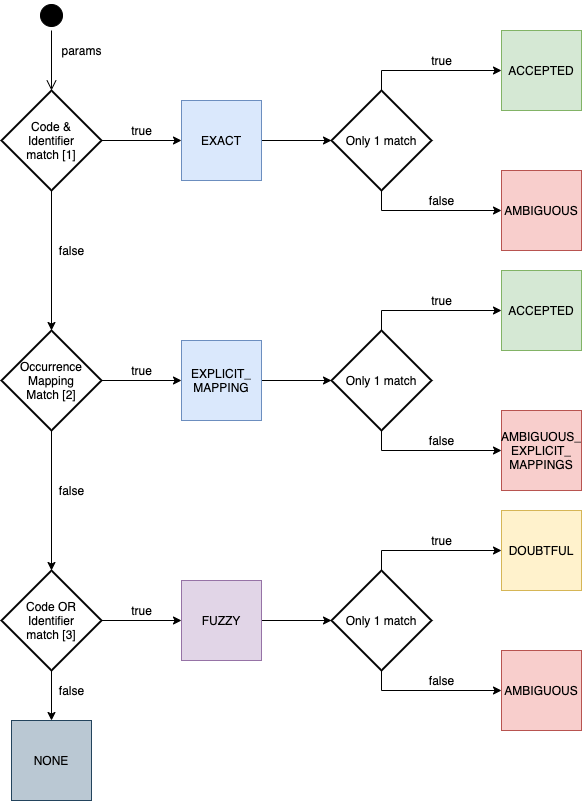

# GBIF Registry Service

This module is intended for future refactoring three layer architecture.

[Parent](../README.md)

## GRSciColl Lookup Explained

The lookup can receive any of these [parameters](https://github.com/gbif/gbif-api/blob/master/src/main/java/org/gbif/api/model/collections/lookup/LookupParams.java).
All of them are optional.

The matching for institutions and collections is almost independent for each of them with a few exceptions that will be explained later.
The overall matching process for each entity is as follows:

[1]

The identifier match also includes the matches by key (UUID).

Also, there are some specific conditions based on the entity type:
- Institutions: if the `ownerInstitutionCode` is different than the institutions matched we discard them and
flag them as `AMBIGUOUS_OWNER`

[2]

When the `datasetKey` param is provided and there is no exact matches we check the [occurrence mappings](https://github.com/gbif/gbif-api/blob/master/src/main/java/org/gbif/api/model/collections/OccurrenceMapping.java).
Both the `code` and the `identifier` are optional in the `OccurrenceMapping`. They can be used to refine the mappings
when there are more than 1 possible combination within a dataset.

[3]

A fuzzy match happens when some fields match but not the `code` and the `identifier` at the same time. Examples of these matches are:
- Only the `code` matches
- Only the `identifier` matches
- An `alternativeCode` matches
- The `code` param matches with the `name` of an entity
- The `identifier` param matches with the `name` of an entity

Additionally, if there is more than 1 fuzzy match we try to check if one of the matches is better than the others
and we can set it as the accepted one. This works as follows:
1. If there is only 1 entity where the `identifier` matches we take it
2. If there is only 1 entity where either the `code` or the `identifier` matches **and** another field matches we take it.
3. If the `country` param was provided and there is only 1 entity where the `country` matches we take it

Furthermore, there are some specific conditions based on the type of the entities:
- Institutions: if the `ownerInstitutionCode` is different than the institutions matched we discard them and
flag them as `AMBIGUOUS_OWNER`
- Collections: if the institution of the collections found doesn't match with the institutions previously matched we discard
them and flag them as `AMBIGUOUS_INSTITUTION_MISMATCH`

Finally, if we want to know more we can send the `verbose` parameter as `true` and all the matches found will be returned.
